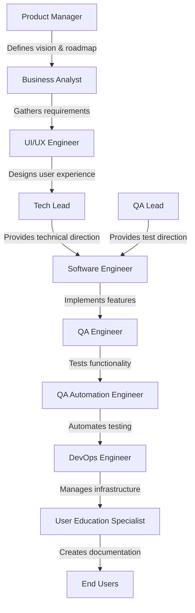
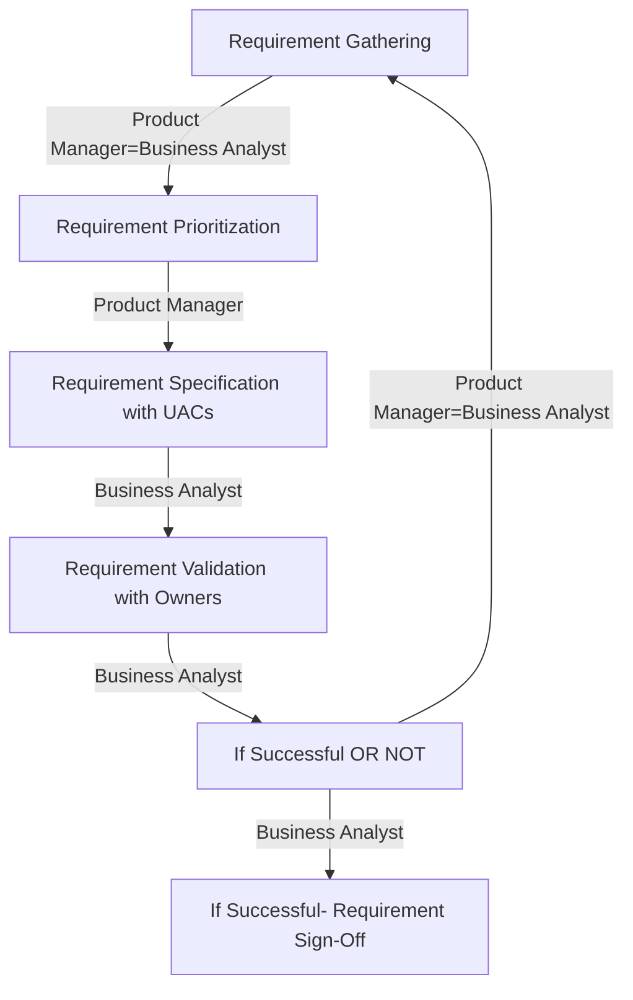

# End-to-End Product Development Responsibilities

End-to-end product development involves collaboration among various roles, each contributing unique expertise to ensure the successful delivery of a product.

## Streamlined Flow Diagram

# Stages of Product Development (Mermaid Format)

## 1. Product Manager (PM)

- Define the product vision and strategy.
- Prioritize features and create a product roadmap.
- Act as the primary liaison between stakeholders and the development team.
- Ensure the product aligns with business goals and customer needs.

## 2. Business Analyst (BA) / Product Specialist (PS)

- Gather and document business requirements.
- Analyze and translate requirements into functional specifications.
- Collaborate with stakeholders to ensure clarity and feasibility.
- Support the team in understanding business objectives.

## 3. UI/UX Engineer

- Design intuitive and user-friendly interfaces.
- Conduct user research and usability testing.
- Create wireframes, prototypes, and design assets.
- Ensure the product delivers an optimal user experience.

## 4. Tech Lead

- Provide technical direction and guidance to the development team.
- Architect the system and ensure scalability, performance, and security.
- Review code and enforce best practices.
- Act as a bridge between technical and non-technical stakeholders.

## 5. QA Lead

- Define the testing strategy and quality standards.
- Plan and manage testing activities across the team.
- Ensure comprehensive test coverage and defect tracking.
- Collaborate with stakeholders to address quality concerns.

## 6. Software Engineer

- Write clean, efficient, and maintainable code.
- Implement features based on technical and functional requirements.
- Debug and resolve issues in the codebase.
- Collaborate with other team members to deliver high-quality software.

## 7. QA Engineer

- Execute manual and automated test cases.
- Identify, document, and track defects.
- Validate that the product meets functional and non-functional requirements.
- Work closely with developers to ensure timely issue resolution.

## 8. QA Automation Engineer

- Develop and maintain automated test scripts.
- Integrate automated tests into the CI/CD pipeline.
- Ensure the reliability and scalability of automated testing frameworks.
- Reduce manual testing efforts while maintaining quality.

## 9. User Education Specialist

- Create user documentation, tutorials, and guides.
- Develop training materials for end-users.
- Ensure users understand and can effectively use the product.
- Gather feedback to improve user education resources.

## 10. DevOps Engineer

- Manage infrastructure and deployment pipelines.
- Automate build, deployment, and monitoring processes.
- Ensure system reliability, scalability, and performance.
- Collaborate with the team to streamline development and operations.

---

Each role plays a critical part in the product development lifecycle, ensuring that the product is delivered on time, meets quality standards, and satisfies user needs.
