# Stages of Product Development (Mermaid Format)

```mermaid
flowchart TD
    1[Requirement Gathering] -->|   Product Manager=Business Analyst     | 2[Requirement Prioritization]
    2[Requirement Prioritization] -->|  Product Manager   | 3[Requirement Specification with UACs]
    3[Requirement Specification with UACs] -->| Business Analyst | 4[Requirement Validation with Owners]
    4[Requirement Validation with Owners] -->| Business Analyst | 5[If Requirement Successful OR NOT]
    5[If Requirement Successful OR NOT] -->|  Product Manager=Business Analyst          | 1[Requirement Gathering]
    5[If Requirement Successful OR NOT] -->|   Business Analyst          | 6[If Successful- Requirement Sign-Off]
    6[If Successful- Requirement Sign-Off] -->|   Business Analyst          | 7[Wireframing]

    7[Wireframing] -->|   UI/UX Engineer          | 8[User Validation]
    8[User Validation] -->|   UI/UX Engineer          | 9[If WireFraming Successful OR NOT]
    9[If WireFraming Successful OR NOT]  -->|   UI/UX Engineer          | 7[Wireframing]
    9[If WireFraming Successful OR NOT] -->|   UI/UX Engineer          | 10[UI Design]

    10[UI Design] -->|   UI/UX Engineer          | 11[UI Design Review]
    11 -->|   UI/UX Engineer          | 12[If UI Design Accepted or NOT]
    12 -->|   UI/UX Engineer          | 10[UI Design]
    12 -->|   UI/UX Engineer          | 13[Technical Design]

    13 -->|   Tech Lead          | 14[Technical Design Review]
    14 -->|   Tech Lead          | 15[If Technical Design Accepted or NOT]
    15 -->|   Tech Lead          | 13[Technical Design]

    15 -->|   Tech Lead / UI/UX Engineer          | 16[If Technical Design & UI Design are Accepted]
    12 -->|   Tech Lead / UI/UX Engineer          | 16[If Technical Design & UI Design are Accepted]

    16 -->|   QA Lead          | 17[Test Design]
    17 -->|   QA Lead          | 18[Test Design Review]
    18 -->|   QA Lead          | 19[If Test Design Accepted or NOT]
    19 -->|   QA Lead          | 17[Test Design]
    19 -->|   QA Lead          | 20[Test Cases]

    20 -->|   QA Engineer          | 21[Test Cases Review]
    21 -->|   QA Lead          | 22[If Test Cases Accepted or NOT]
    22 -->|   QA Lead          | 20[Test Cases]
    22 -->|   QA Lead          | 23[Test Cases Review with UACs]

    23 -->|  Business Analyst /QA Lead        | 24[If Test Cases Review with UACs Accepted Or NOT]
    24 -->|  Business Analyst         | 20[Test Cases]
    24 -->|  Business Analyst         | 25[POC]

    25 -->|  Software Engineer         | 26[Implementation]
    26 -->|  Software Engineer         | 27[Unit Testing]
    27 -->|  Software Engineer         | 28[ Dev Testing with the test cases]
    28 -->|  Software Engineer         | 29[ If Test Cases Passed Or NOT]

    29 -->|  Software Engineer         | 26[Implementation]
    29 -->|  Software Engineer         | 30[ Code Review]

    30 -->|  Tech Lead         | 31[ If Code Review Accepted or NOT]

    31 -->|  Tech Lead         | 26[Implementation]
    31 -->|  Tech Lead         | 32[ UI & UAC Review]

    32 -->|  Business Analyst/UI/UX Engineer          | 33[ If UI & UAC Review Accepted or NOT]

    33 -->|  Business Analyst/UI/UX Engineer         | 26[Implementation]
    33 -->|  Business Analyst/UI/UX Engineer         | 34[ Raise a PR]

    34 -->|  Software Engineer          | 35[ PR Review]
    35 -->|  Tech Lead         | 36[ If PR Review Accepted or NOT]

    36 -->|  Tech Lead         | 37[ Fix the issues and commit to the PR]
    37 -->|  Software Engineer         | 35[ PR Review]
    36 -->|  Software Engineer         | 38[ PR marged]

    38 -->|  Software Engineer         | 39[ QA testing in the Test Slot]
    39 -->|  QA Engineer               | 40[ If QA testing passed or NOT]
    40 -->|  QA Engineer               | 41[ Create a Defect]
    40 -->|  QA Engineer               | 44[ If Stage Test Automation=stage QA testing then NEXT Stage]
    41 -->|  QA Engineer               | 26[Implementation]

    38 -->|  Software Engineer        | 42[ Test Automation]
    42 -->|  QA Automation Engineer        | 43[ If Test Automation passed or NOT]
    43 -->|  QA Automation Engineer        | 41[ Create a Defect]
    43 -->|  QA Automation Engineer        | 44[ If Stage Test Automation=stage QA testing then NEXT Stage]

    44 -->|  DevOps Engineer        | 45[ push the release to staging slots]
    45 -->|  DevOps Engineer        | 46[ push the release to prod]

    46 -->|  DevOps Engineer        | 50[ END --Closure]

    44 -->|  User Education Specialist        | 47[ End User Documentation]
    47 -->|  User Education Specialist        | 48[ Training Video]
    48 -->|  User Education Specialist        | 49[ Release Material]
    49 -->|  User Education Specialist        | 50[ END --Closure]

    50 -->|  New Requirement        | 1[Requirement Gathering]

```

1.  Requirement Gathering - B[Business Analyst]=A[Product Manager]
2.  Requirement Prioritazation - A[Product Manager]
3.  Requirement Sperification(UACs) - B[Business Analyst]
4.  Requirement Validation with Requirement Owners - B[Business Analyst]
5.  If Requirement Successful - B[Business Analyst] or NOT Successful - Go back to stage 1
6.  Requirement Sign Off - B[Business Analyst]

7.  WireFraming - C[UI/UX Engineer]
8.  User Validation - C[UI/UX Engineer]
9.  If WireFraming Successful - C[UI/UX Engineer] or NOT Successful - Go back to stage 7

10. UI Design - C[UI/UX Engineer]
11. UI Design Review - C[UI/UX Engineer]
12. If UI Design Accepted - C[UI/UX Engineer] or NOT Accepted - Go back to stage 10

13. Technical Design - D[Tech Lead]
14. Technical Design Review - D[Tech Lead]
15. If Technical Design Accepted - D[Tech Lead] or NOT Accepted - Go back to stage 13

16. If Technical Design & UI Design are Accepted - THEN Only Next Stage

17. Test Design - K[QA Lead]
18. Test Design Review - K[QA Lead]
19. If Test Design Accepted - K[QA Lead] or NOT Accepted - Go back to stage 17

20. Test Cases - F[QA Engineer]
21. Test Cases Review - K[QA Lead]
22. If Test Cases Accepted - K[QA Lead] or NOT Accepted - Go back to stage 20

23. Test Cases Review with UACs - B[Business Analyst]
24. If Test Cases Review with UACs Accepted - K[QA Lead] or NOT Accepted - Go back to stage 20

25. POC - E[Software Engineer]
26. Implementation - E[Software Engineer]
27. Unit Testing - E[Software Engineer]
28. Dev Testing with the test cases - E[Software Engineer]
29. If Test Cases Passed - E[Software Engineer] or NOT Accepted - Go back to stage 26

30. Code Review - D[Tech Lead]
31. If Code Review Accepted - E[Software Engineer] or NOT Accepted - Go back to stage 26

32. UI & UAC Review - B[Business Analyst]=C[UI/UX Engineer]
33. If UI & UAC Review Accepted - B[Business Analyst]=C[UI/UX Engineer] or NOT Accepted - Go back to stage 26

34. Raise a PR - E[Software Engineer]
35. PR Review - D[Tech Lead]
36. If PR Review Accepted - D[Tech Lead] or NOT Accepted

37. [NOT Accepted (36)] Fix the issuesand commit to the PR - E[Software Engineer] and Go back to stage 35
38. [Accepted (36)] PR marged - E[Software Engineer]

39. QA testing in the Test Slot - F[QA Engineer]
40. If passed - F[QA Engineer] or NOT Passed -
41. Create a Defect -Go back to 26.

42. Test Automation - G[QA Automation Engineer]
43. If passed - G[QA Automation Engineer] or NOT Passed. Create a Defect(41) -Go back to 26.

44. If Stage Test Automation=stage QA testing then NEXT Stage

45. push the release to staging slots - H[DevOps Engineer]
46. push the release to prod - H[DevOps Engineer]

47. End User Documentation - I[User Education Specialist]
48. Training Video - I[User Education Specialist]
49. Release Material - I[User Education Specialist]

50. END --Closure
